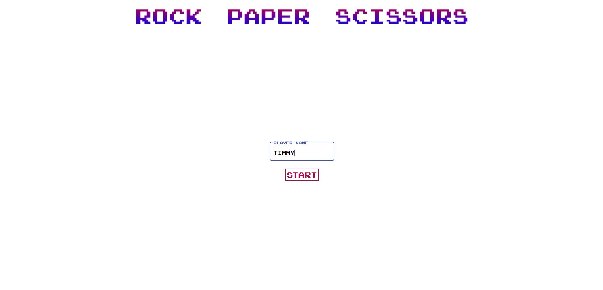
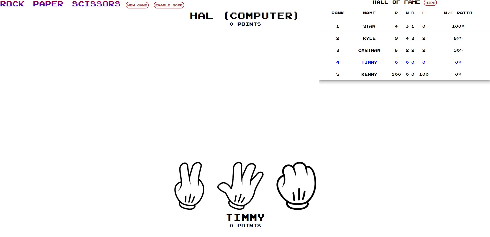
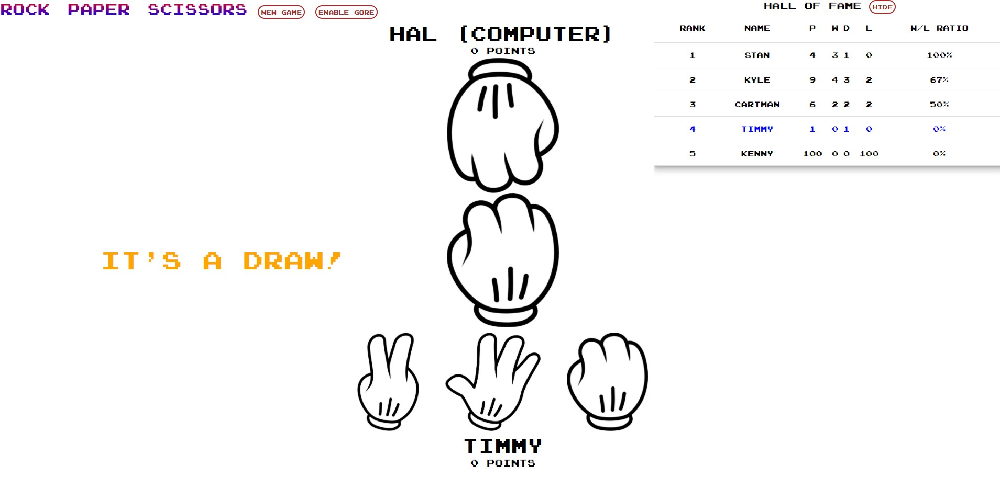

# Rock Paper Scissors Game

Game designed and created by Leo Keogh.

## Assets
All images and fonts used are free and no attribution is required

## Backend
The application does not have a separate backend for proper data persistence.

A REST backend is mocked by an InMemoryDbService (InLocalStorageDataService) which uses the browser's local storage (not secure!) for saving player scores (the application can be restarted without losing player scores).

## Previews

### Welcome page

### Game board page (with Hall of Fame)

after play:

This project was generated with [Angular CLI](https://github.com/angular/angular-cli) version 9.0.0.

## Development server

Run `ng serve` for a dev server. Navigate to `http://localhost:4200/`. The app will automatically reload if you change any of the source files.

## Code scaffolding

Run `ng generate component component-name` to generate a new component. You can also use `ng generate directive|pipe|service|class|guard|interface|enum|module`.

## Build

Run `ng build` to build the project. The build artifacts will be stored in the `dist/` directory. Use the `--prod` flag for a production build.

## Running unit tests

Run `ng test` to execute the unit tests via [Karma](https://karma-runner.github.io).

## Running end-to-end tests

Run `ng e2e` to execute the end-to-end tests via [Protractor](http://www.protractortest.org/).

## Further help

To get more help on the Angular CLI use `ng help` or go check out the [Angular CLI README](https://github.com/angular/angular-cli/blob/master/README.md).
